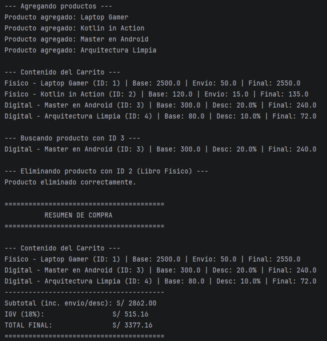

Lab 02 - Carrito de Compras en Kotlin (Con IA)
Prompt Utilizado para la Generación
Actúa como un desarrollador experto en Kotlin y Android Studio.
Genera un sistema de Carrito de Compras ejecutable en consola en un solo bloque de código en Kotlin puro, dentro del paquete 'com.quijada.conia02', aplicando estrictamente la Orientación a Objetos (OO):
1. Abstracción: Clase abstracta 'Producto' con 'calcularPrecioFinal()'.
2. Herencia: Subclases 'ProductoFisico' y 'ProductoDigital'.
3. Encapsulamiento: Lista privada en 'Carrito'.
4. Polimorfismo: Cálculo dinámico de subtotal.
5. Operaciones de negocio: 'buscarProducto', 'eliminarProducto' con 'removeIf', IGV (18%).
6. Función 'main()': Ejecución completa por consola.

7. Captura de Ejecución
