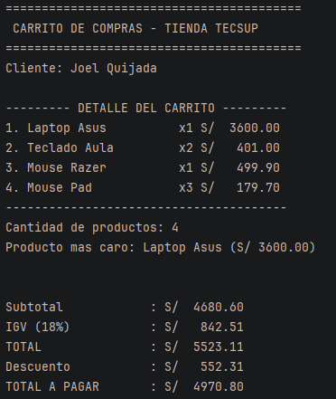

Labotarorio02: Carrito de compras en Kotlin
Estudiante: Joel Facundo Quijada Zevallos
Descripcion: Aplicacion desarrollada en Kotlin que simula un carrito de compras. El programa gestiona una lista de productos usando una data class, calcula el subtotal, el igv, el total, aplica descuentos condicionales con la estructura when e identifica el producto de mayor precio mediante la funcion de coleccion con maxByOrNull.
Funciones Implementadas:
calcularSubtotal: Recorre la lista de productos y calcula la suma total antes de impuestos
calcularIGV: Aplica la tasa del 18% al subtotal
calcularTotal: Suma el subtotal más el IGV
calcularDescuento: Evalua mediante when si el monto total supera 3000 o 5000
mostrarDetalle: Muestra el detalle de la lista alineando columnas con String.format

¿Por qué nombre y precio son val pero cantidad es var?
nombre y precio usan val porque son atributos inmutables del producto que no deben cambiar durante la transicion en cambio cantidad usar var porque es un valor que el cliente puede modificar al añadir o quitar unidades del mismo producto.

¿Qué pasaría si intentas cambiar el precio después de crear el producto?
El programa se detiene con un error porque no se puede modificar variables de tipo val, asi evitando que alguien modifique el precio.

Resultado en la consola
