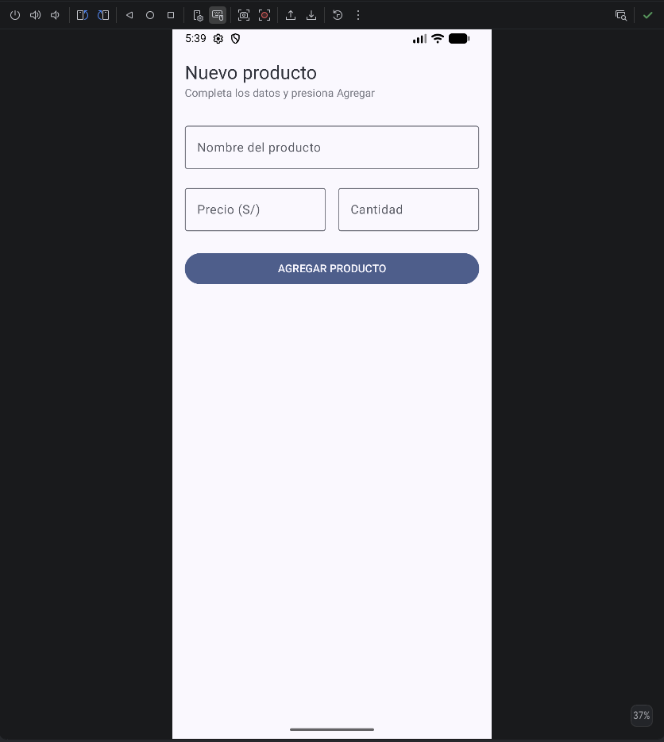
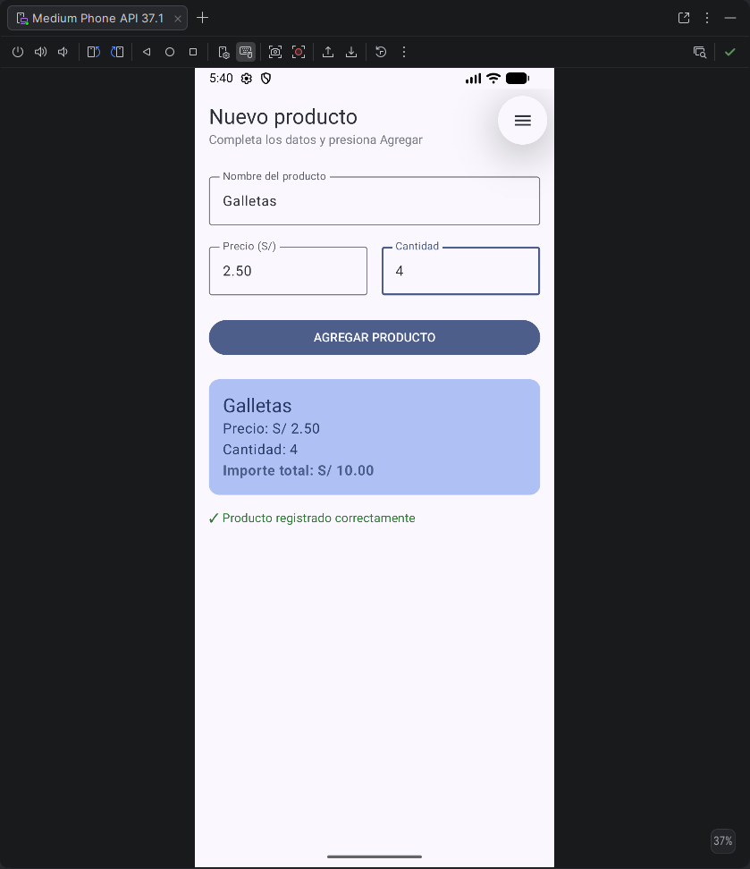

Laboratorio 03: Registro de Producto

Estudiante: Joel Facundo Quijada Zevallos
Capturas de Pantalla
Pantalla Vacia: 
Producto Registrado: 

Pregunta: ¿Qué pasaría si declaras las variables de los campos SIN remember?
Si se declaran sin remember, el usuario no podra escribir nada en los campos. En cada tecla presionada ocurre una recomposicion y las variables se vuelven a inicializar desde cero en texto vacio. remember es necesario para guardar el estado durante las recomposiciones.